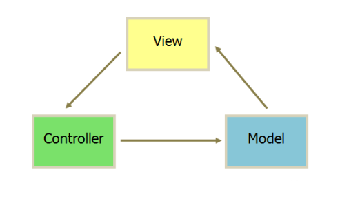
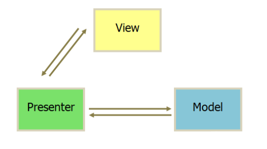
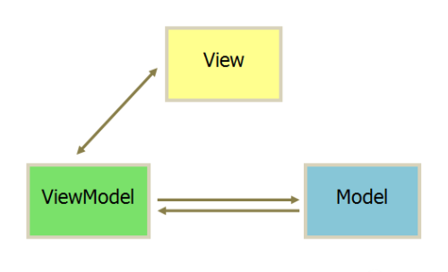

# 请画出 MVC、MVP 和 MVVM 这三种模式的设计图，描述它们的适用场景和优缺点

## 自答

### MVC 

| 意义 | 说明
| - | -
| Model	| 模型层，数据模型或业务模型，就是我们要显示给用户查看的内容。
| View | 视图层，就是用户直接看到的界面，例如：Activity，Fragment，自定义 View，还有 XML 布局文件。
| Controler	| 控制层，用于模型和视图间切换数据，对应于 Activity 业务逻辑，数据处理和 UI 处理。

* 环形通信方式，所有通信都是单向的。
* View 传送指令到 Controller。
* Controller 起到不同层面间的组织作用，用于控制应用程序的流程。它处理事件并作出响应。“事件”包括用户的行为和数据 Model 上的改变。
* Model 将新的数据发送到 View，用户得到反馈。

优点：简单直接。

缺点：通常情况下 Activity 作为 View 和 Controller 的合体，即要负责视图的显示又要加入控制逻辑，承担的功能过多从而导致代码量巨大。

### MVP 

| 意义 | 说明
| - | -
| Model |	依然是实体模型。
| View |	对应于 Activity 和 xml，负责 View 的绘制以及与用户交互。
| Presenter |	负责完成 View 于 Model 间的交互和业务逻辑。

* 各部分之间的通信，都是双向的。
* View 与 Model 不发生联系，都通过 Presenter 传递。
* View 非常薄，不部署任何业务逻辑，称为”被动视图”（Passive View），即没有任何主动性，而 Presenter 非常厚，所有逻辑都部署在那里。

在 MVP 模式下，Activity 或 Fragment 只承担了 View 层的角色，Cotroller 的角色则完全由 Presenter 扮演，View 层和 Presenter 层的通信通过接口实现。

优点：
* MVP 模式会解除 View 与 Model 的耦合，有效的降低 View 的复杂性。同时又带来了良好的可扩展性、可测试性，保证系统的整洁性和灵活性。
* 理想化的 MVP 模式可以实现同一份逻辑代码搭配不同的显示界面，因为它们之间并不依赖于具体，而是依赖于抽象。这使得 Presenter 可以运用于任何实现了 View 逻辑接口的UI，使之具有更广泛的适用性，保证了灵活度。
* 方便测试。比如说，在未完成界面的情况下完成接口测试，只需写一个 Java 类并实现对应的接口，Presenter 通过网络获取数据后能调用相应的方法。相反的，在接口未完成联调的情况下正常显示界面，由 Presenter 提供测试数据。

缺点：
* Activity 需要实现各种跟 UI 相关的接口，同时要在 Activity 中编写大量的事件，然后在事件处理中调用 presenter 的业务处理方法，View 和Presenter 只是互相持有引用并互相做回调,代码不美观。
* 这种模式中，程序的主角是 UI，通过 UI 事件的触发对数据进行处理，更新 UI就要考虑线程的问题。而且 UI 改变后牵扯的逻辑耦合度太高，一旦控件更改（比较 TextView 替换 EditText 等）牵扯的更新 UI 的接口就必须得换。
* 复杂的业务同时会导致 presenter 层太大，代码臃肿的问题。

### MVVM

| 意义 | 说明
| - | -
| Model |	实体模型，代表基本业务逻辑。
| View | 对应于 Activity 和 xml，负责 View 的绘制以及与用户交互。
| ViewModel |	将 View 和 Model 联系在一起，起到桥梁的作用，负责完成 View 于 Model 间的交互，负责业务逻辑。

* 基本上与 MVP 模式完全一致。 
* 唯一的区别是，它采用双向绑定：View 的变动，自动反映在 ViewModel 上，反之亦然。

优点：
* **数据驱动**：由数据自动去驱动 UI 去自动更新 UI，UI 的改变又同时自动反馈到数据，数据成为主导因素，这样使得在业务逻辑处理只要关心数据，方便而且简单很多。
* **低耦合度**：数据是独立于UI的，ViewModel只负责处理和提供数据，UI想怎么处理数据都由UI自己决定，ViewModel 不涉及任何和UI相关的事也不持有UI控件的引用。
* **可复用性**：一个 View Model 复用到多个 View 中，同样的一份数据，用不同的 UI 去做展示，对于版本迭代频繁的 UI 改动，只要更换 View 层就行。

### 总结

我们针对业务模型，建立的数据结构和相关的类，就可以理解为 Android App 的 Model，Model 是与 View 无关，而与业务相关的，例如数据库读取数据，应该是属于 Model 层的事情。

> 至于为什么我们通常直接去在 Activity 中去写数据库数据读取，我的猜想是因为简单。试想，如果是为了规范，首先定义一个 `getDataFromDB()` 的接口，再写个类实现 `getDataFromDB()` 方法，以后如果改了请求数据所用的方法，直接改写实现类，听起来确实不错，可是仅仅是为了从数据库读点数据，额外添加了至少两个类文件真的有意义吗。
> 
> 当然网络请求，是属于业务逻辑层 C 层。

MVP 中的 Presenter 真正需要处理的并非业务逻辑，而应该是视图逻辑。业务逻辑应该是视图无关的，可以是单独的一个类中，也可以是在 P 中。P 与 V 是一对多关系。EventBus 应该作用于 P 层，在 P 层发送，在 P 层接收。

MVVM 中，M 层改变并不是直接改变 V 层，而是通过 VM 层去改变 V 层。M 与 V 依旧是不直接操作的。

参考文章

* [MVC，MVP，MVVM设计模式的比较](https://blog.csdn.net/axi295309066/article/details/52596220)